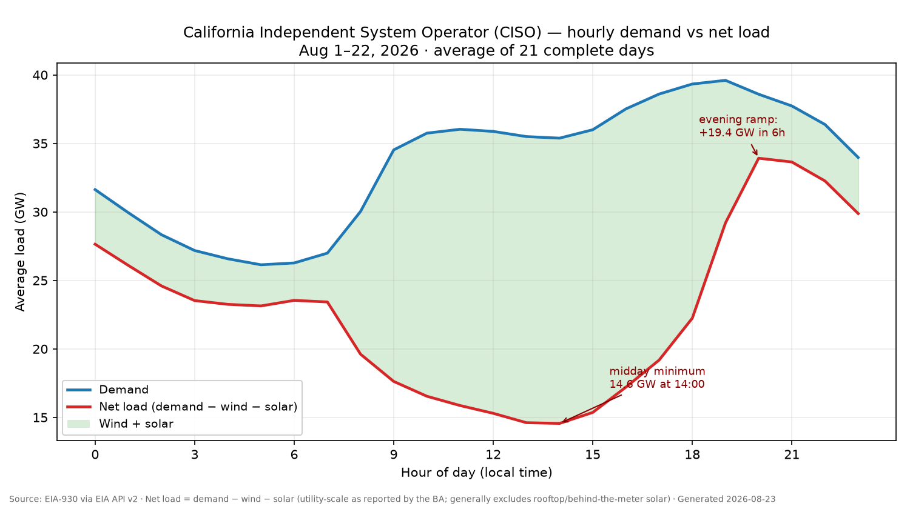
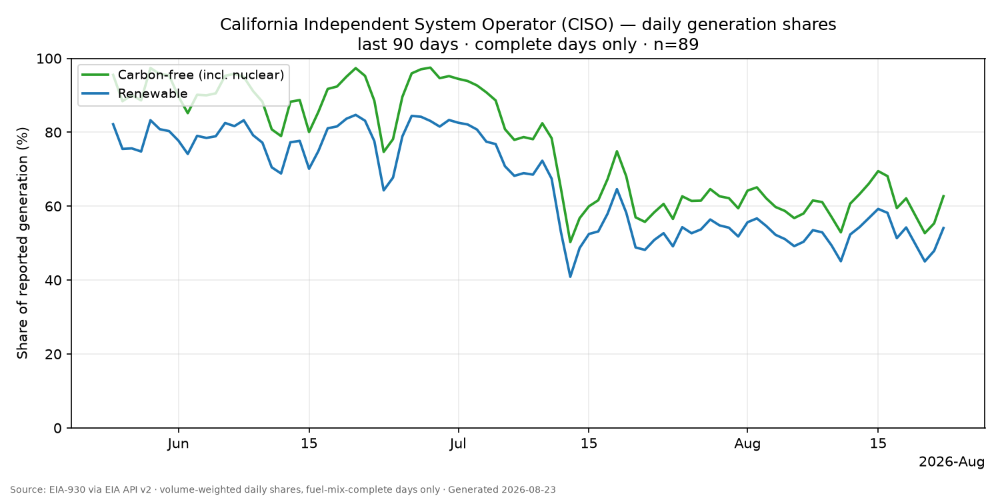
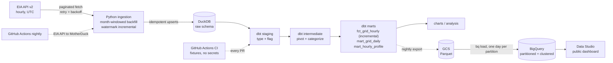

# energy-grid-pipeline

[](https://github.com/JosephWong333/energy-grid-pipeline/actions/workflows/ci.yml)
[](https://github.com/JosephWong333/energy-grid-pipeline/actions/workflows/nightly.yml)


Hourly US power-grid analytics, end to end: demand, net generation, interchange,
and fuel mix for 11 balancing authorities (CAISO, ERCOT, MISO, PJM, …), ingested
from the [EIA-930 API](https://www.eia.gov/opendata/) into DuckDB and modeled
with dbt into tested, documented marts — renewable share, net load, the duck
curve, peak analytics.

The entire pipeline — ingestion, models, and 123 data tests — runs in CI on every
pull request with **zero credentials**, using deterministic API-shaped fixtures
that flow through the exact same parse-and-load path as live data. A nightly
GitHub Actions job refreshes real data into MotherDuck, then publishes the
finished marts to BigQuery behind a public dashboard — authenticating to Google
with keyless Workload Identity Federation, so no service-account key exists in
this repo or its secrets.





## Live dashboard

**[Open the dashboard →](https://datastudio.google.com/reporting/3f414fc8-0ba0-45e9-a904-f280bd7ac50e)** — public, no login.

Two views on the BigQuery marts: the CISO **duck curve** (average demand vs.
average net load by local hour — the gap between the lines is solar), and
**renewable share by month** across all 11 balancing authorities.

The nightly exports the marts to Parquet on GCS and loads them into BigQuery
one day per partition. A reload replaces its partition wholesale, so the
publish is idempotent for the same reason the dbt run is: re-running converges
instead of accumulating.

## Architecture



## Quickstart

**No API key needed** — run the whole thing on synthetic fixtures first:

```bash
git clone https://github.com/JosephWong333/energy-grid-pipeline.git
cd energy-grid-pipeline
python3 -m venv .venv && source .venv/bin/activate
make setup      # pip install + dbt deps
make dev        # fixtures -> ingest -> dbt build (123 tests) -> charts, all on data/dev_fixtures.duckdb
```

**Real data** (free EIA key, ~1 minute to get):

```bash
cp .env.example .env          # paste your key from eia.gov/opendata/register.php

# Pilot first, on a THROWAWAY database — prove the key and the API behave
# before committing to hours of backfill. Replay never writes watermarks,
# and the pilot db is deleted, so nothing about this can poison the real run:
GRID_DB_PATH=data/pilot.duckdb python -m grid_pipeline.ingest --mode backfill --replay-since $(date -d '7 days ago' +%F)
rm data/pilot.duckdb

make backfill                 # full history since 2019 (resumable; typically
                              # 20-45 min, dominated by API round-trips —
                              # inserts are vectorized at ~160k rows/s)
make build                    # dbt models + tests
make charts                   # regenerates README charts from live data
```

Daily refresh afterwards is `make incremental` (raw ingest *and* a mart
rebuild; `make incremental-raw` for ingest-only) — or let the nightly GitHub
Action do it (see `.github/workflows/nightly.yml` for the two required secrets).

**One-time cloud setup for the nightly run.** The prod target connects with
`md:energy_grid`, which *attaches* an existing MotherDuck database — it will
not create one. Before the first nightly run, create it once in a MotherDuck
notebook:

```sql
CREATE DATABASE energy_grid;
```

Otherwise the run fails with `no database/share named 'energy_grid' found`.
(Deliberate on MotherDuck's part: a typo in a connection string shouldn't
silently spawn an empty database.)

## Data model

| Layer | Models | What happens |
|---|---|---|
| `raw` | `eia_region_data`, `eia_fuel_mix` | Landed by Python with PKs on natural grain; `INSERT OR REPLACE` makes every load idempotent |
| staging | `stg_eia__grid_metrics`, `stg_eia__fuel_mix` | Rename, type, and **flag** quality issues (never drop) |
| intermediate | `int_grid_metrics_pivoted`, `int_fuel_mix_by_category` | Long→wide pivot; fuel categorization with renewable vs carbon-free totals |
| marts | `fct_grid_hourly` (incremental), `mart_grid_daily`, `mart_hourly_profile` | One row per BA-hour with net load + shares; daily rollups; average hourly shapes |

Key mart columns: `net_load_mwh` (demand − wind − solar; the duck-curve
metric), `renewable_share` vs `carbon_free_share` (nuclear counts in the
second, not the first), `peak_demand_hour`, `load_factor`, per-fuel MWh.

## Design decisions

**Late-arriving data.** EIA restates recent hours as balancing authorities
revise their reports. Ingestion therefore re-fetches a 72h lookback window on
every incremental run (idempotent by PK upsert), and `fct_grid_hourly`
reprocesses a 96h window with `delete+insert` on its grain. Restatements are
self-healing end to end. Anything older is repaired **at the source** with a
forced replay — `make replay SINCE=YYYY-MM-DD` re-fetches raw history through
the same idempotent upserts *and then full-refreshes every mart*, because a
source repair is only half done while marts built before it still hold the
old values (`make replay-raw` stages source-only repairs). (A dbt `--full-refresh` rebuilds marts from raw;
it cannot repair raw itself.) I considered dbt's microbatch strategy and chose an explicit
lookback because the mechanism stays visible in the model and ports to any
adapter.

**Per-BA incremental watermarks.** The lookback cutoff is computed per
balancing authority, not from a global `max(period_utc)`. A global cutoff
silently skips the entire history of a newly added BA (its 2019 rows fall
"behind" authorities that are already current); with per-BA watermarks, a BA
with no rows in the fact gets its full history on the next ordinary run. The
same idea applies at ingestion: an incremental run that finds a never-loaded
(route, BA) pair bootstraps it through the same resumable month windows a
backfill uses, so the first run against an empty prod warehouse is
crash-safe rather than one fragile giant request range.

**UTC in, local derived.** Raw periods are stored exactly as EIA serves them
(UTC). Local wall-clock time is derived in dbt via each BA's IANA timezone
from a seed. Storing UTC sidesteps DST duplicate/missing-hour bugs at
ingestion; deriving local enables the analyses that actually need wall time
(evening peaks, duck curves).

**Flag, don't drop.** Real EIA data contains negative-demand glitches, missing
hours, and nulls. Staging preserves every row and attaches boolean quality
flags; marts decide their own policy (daily aggregates exclude flagged hours
*and* count them). A test enforces that every negative value is flagged — the
flag logic itself is under test.

**Month-windowed, resumable backfill.** History loads one (route, BA, month)
window at a time with a watermark advanced per window. Requests stay small,
progress survives crashes, and re-running never duplicates.

**CI without secrets.** The fixture generator writes deterministic,
API-shaped JSON pages for **all ten configured balancing authorities**, each
with a distinct grid archetype (solar-heavy CISO, wind-heavy ERCO/SWPP,
hydro-dominant BPAT, ...), local-time shapes from the seed's IANA zones via
`zoneinfo`, and a fixed slice around the 2026-03-08 spring-forward so
DST-exact completeness is exercised in every CI run. Planted quirks mirror
the live feed: string/null values, a negative-demand hour, an absent fuel
report, an absent-solar hour, a missing demand row, and a 600 GWh fuel
outlier. They ingest through the exact production parse/upsert path into a
separate warehouse (`data/dev_fixtures.duckdb`) — synthetic and real data never share a
database file, the ingester refuses to cross the streams, every raw row
carries `_source` lineage, and charts fail closed to a watermark unless
row-level provenance proves the data real. Every PR builds the entire
warehouse and runs the full test suite.

**DuckDB (+ MotherDuck for prod).** The working set is a few million rows —
an ideal fit for DuckDB locally and MotherDuck as a zero-ops cloud target.
Same SQL, same dbt project, a one-line profile switch.

**BigQuery as a serving layer, not a second transform engine.** DuckDB stays
the only place models run; the nightly publishes *finished* marts so a BI tool
can read them without a MotherDuck token. It's a copy, not a fork. Running the
same suite on two engines that disagree on nulls-in-aggregates, integer
division, and timestamp arithmetic would double the test surface to serve a
table under a gigabyte. Past that size the answer is dbt-bigquery with
cross-db macros — not this.

**GitHub Actions as the orchestrator.** A daily batch with one dependency
chain doesn't need an always-on scheduler. Cron-triggered Actions are free,
observable, and honest about the workload. (An Airflow version of this
pattern lives in my [retail pipeline](https://github.com/JosephWong333/retail-analytics-data-platform).)

## Testing

- **123 dbt data tests** on every build: grain uniqueness, nullability,
  accepted ranges, relationship integrity, a symmetric fact↔source
  reconciliation, and custom `non_negative` checks scoped to unflagged rows.
  Severities are deliberate: a new fuel code *warns* (data keeps flowing
  into `other_mwh`, and it surfaces in the CI status and nightly log);
  broken grain, lost rows, or a missing balancing authority *error*.
- **Two EIA-930 identity tests** (warn): `demand ≈ net_generation −
  total_interchange` and `Σ fuel ≈ net_generation`, evaluated only on
  complete, unflagged hours. Tolerances are deliberately wide sanity bands
  (live BA reporting doesn't reconcile tightly); the observability surface
  is `mart_identity_residuals` — a *diagnostic* mart (nothing consumes it
  automatically yet) holding daily per-BA residual distributions, for
  tuning per-BA tolerances on evidence after the first backfill.
- **Seed-driven coverage** (error): every *seeded* balancing authority
  must have metrics within 5 days and a fuel report within 7. Because the
  check runs against the seed rather than whatever rows exist, an entirely
  absent BA fails loudly instead of vanishing from its own freshness check,
  and one current row can't mask nine silent routes.
- **31 Python unit tests**: pagination (with truncation detection),
  response integrity (wrong-respondent, out-of-window, or odd-unit rows
  raise before any upsert or watermark motion),
  per-request throttling, replay/watermark semantics (a short pilot can
  never poison a backfill; watermarks are monotonic by construction),
  retry/backoff (honoring *and capping*
  `Retry-After`), type coercion against a recorded API response, idempotent
  upserts, watermark round-trips, window construction, and regression tests
  for the fixture/real contamination guards and fail-closed provenance.
- **Source freshness** SLAs on raw tables (warn 36h / error 96h), checked
  nightly.
- **Pinned environment**: `requirements.lock` is a full `pip freeze` —
  every transitive dependency — and it's what `make setup`, CI, and the
  nightly job actually install (`-r requirements.lock` + `-e . --no-deps`).
  dbt package resolution ships pinned in `dbt/package-lock.yml`.

## Data notes & quirks

- Negative **total interchange** is legitimate (net imports — CAISO is
  usually negative). Negative **demand** is a reporting glitch and gets
  flagged.
- Storage and hybrid fuels (`PS`, `BAT`, `OES`, `SNB`, `WNB`) legitimately
  report negative when charging; hourly share metrics can exceed 1.0 in
  those hours because charging shrinks the denominator. The share range
  tests are scoped to non-charging hours, where the [0,1] invariant
  actually holds.
- **Missing is not zero.** EIA publishes demand well before fuel mix, so the
  newest hours often have demand but no fuel report yet. `net_load_mwh` is
  only computed when the hour's fuel report exists (`is_net_load_valid`);
  completeness flags (`is_region_complete`, `is_fuel_reported`) travel with
  every fact row, and charts/profiles use complete data only.
- **EIA changed its fuel vocabulary in 2024Q3**, splitting solar/wind into
  with/without-storage variants (`SUN`/`SNB`, `WND`/`WNB`) and adding `GEO`,
  `BAT`, `OES`. The fuel seed maps every code to a `fuel_group`, so a
  2019-present backfill aggregates consistently across the change (hybrid
  discharge counts as renewable — documented choice).
- Demand and generation here are **as reported by balancing authorities to
  EIA**: utility-scale only, and they generally exclude
  rooftop/behind-the-meter solar (EIA's own caveat). Net
  load from this feed is a proxy, and charts say so.
- BAs don't always report symmetric interchange (A→B can disagree with
  B→A), so interchange-based aggregates carry that source-level noise.
- DST transition days have 23 or 25 local hours; `mart_grid_daily` exposes
  `is_complete_day` so consumers can filter fairly.
- MISO's footprint spans two timezones; its market runs on Eastern
  Prevailing Time (EPT = EST/EDT), so the seed maps MISO to
  `America/New_York`. "Local time" throughout this project means the
  operator's market time, which per PUDL's EIA-930 notes does not always
  match a BA's physical geography.
- Fuel codes EIA adds in the future roll into `other_mwh` and trip a
  warn-level test rather than breaking the pipeline.
- Warehouses created before row-level lineage existed classify as `unknown`
  provenance; real ingestion modes refuse them by design. Upgrading means
  deleting the old file and backfilling clean — provenance can't be
  retrofitted onto rows that never recorded it.

## Roadmap

- **CAISO OASIS integration** — nodal LMP prices joined to the EIA demand/mix
  data (price spikes vs net-load ramps). Deliberately out of v1 scope: the
  OASIS API's quirks earn their own milestone.
- Weather features (NOAA) for demand-driver analysis.
- Volume-weighted renewable share — carry the numerator and denominator
  through `mart_grid_daily`, not just the finished ratio, so monthly rollups
  weight by generation instead of averaging daily ratios.

## Attribution

Data: U.S. Energy Information Administration, Form EIA-930 (Hourly Electric
Grid Monitor), via the [EIA Open Data API](https://www.eia.gov/opendata/).
EIA data is in the public domain. MIT licensed.

## Documented future work (deliberately out of scope)

- **Source deletions**: replay repairs inserts and value changes via
  idempotent upserts; a row EIA deletes outright survives locally.
  Reconciling deletions means diffing whole windows transactionally.
- **Per-BA outlier tuning**: publication is already gated by an hour-local,
  BA-relative bound (no single fuel group may exceed 3x the hour's own net
  generation) on top of the global unit-error ceiling. Tightening to
  deviation-from-rolling-median per BA is a refinement to tune from
  `mart_identity_residuals` after real history exists.
- **Alerting**: warn-level tests and the residuals mart leave evidence in
  logs; nothing pages a human. Wiring a consumer (workflow summary,
  threshold job) is the next operational step.
