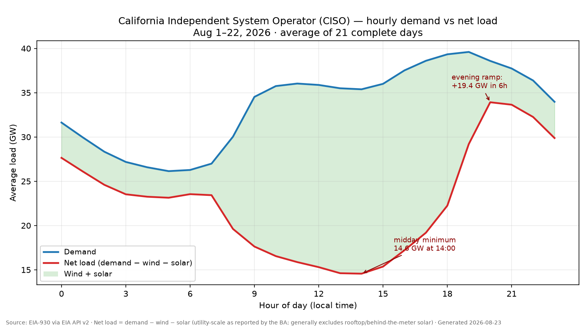
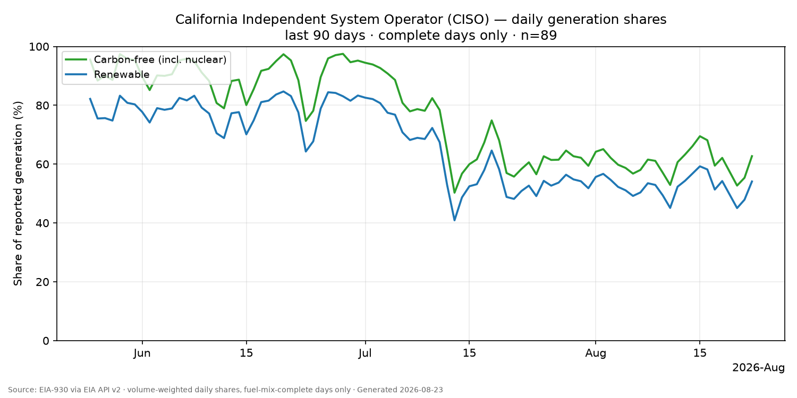
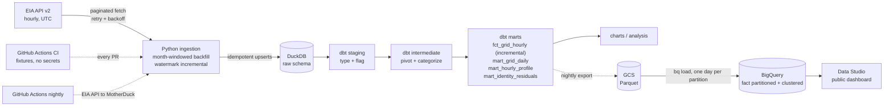

# energy-grid-pipeline

[](https://github.com/JosephWong333/energy-grid-pipeline/actions/workflows/ci.yml)
[](https://github.com/JosephWong333/energy-grid-pipeline/actions/workflows/nightly.yml)


**[Live dashboard](https://datastudio.google.com/reporting/3f414fc8-0ba0-45e9-a904-f280bd7ac50e)** · **[Model docs](https://josephwong333.github.io/energy-grid-pipeline/)** · **[Nightly runs](https://github.com/JosephWong333/energy-grid-pipeline/actions/workflows/nightly.yml)**

Hourly US power-grid analytics, end to end: demand, net generation, interchange,
and fuel mix for 11 balancing authorities (CAISO, ERCOT, MISO, PJM, …), ingested
from the [EIA-930 API](https://www.eia.gov/opendata/) into DuckDB and modeled
with dbt into tested, documented marts — renewable share, net load, the duck
curve, peak analytics.

| At a glance | |
|:---|:---|
| **Coverage** | 11 US balancing authorities (CAISO, ERCOT, MISO, PJM, NYISO, ISO-NE, SPP, BPA, FPL, Duke, Southern), hourly since 2019 |
| **Scale** | 7.7M+ raw rows → 746K+ row hourly fact table |
| **Quality** | 124 dbt data tests + 48 unit tests on every PR, with zero credentials |
| **Runs** | Nightly on GitHub Actions since Aug 2026: EIA → MotherDuck → BigQuery → dashboard |
| **Security** | Keyless Google auth (Workload Identity Federation): no service-account key exists |
| **Cost** | $0/month on free tiers |
| **Stack** | Python · DuckDB/MotherDuck · dbt · GitHub Actions · BigQuery · GCS · Google Data Studio (formerly Looker Studio) |

The entire pipeline — ingestion, models, and 124 data tests — runs in CI on every
pull request with **zero credentials**, using seeded, API-shaped fixtures
that go through the same parser and upsert code as live data. A nightly
GitHub Actions job refreshes real data into MotherDuck, then publishes the
finished marts to BigQuery behind a public dashboard — authenticating to Google
with keyless Workload Identity Federation, so no service-account key exists in
this repo or its secrets.





## Live dashboard

**[Open the Data Studio dashboard →](https://datastudio.google.com/reporting/3f414fc8-0ba0-45e9-a904-f280bd7ac50e)** — built in Google Data Studio (formerly Looker Studio); public, no login.

Two views on the BigQuery marts: the CAISO (`CISO`) **duck curve** (average
demand vs. average net load by local hour — the gap between the lines is wind
plus solar), and **renewable share by month** across all 11 balancing
authorities.

The nightly exports the four marts to Parquet on GCS and loads them into
BigQuery: the hourly fact one day per partition (the last 5 days each night,
plus any older day a recent ingest touched, or one whole-table load when
that is more than a month of days), the three small marts as whole-table
replaces. Every load replaces its target, so the publish is idempotent for
the same reason the dbt run is: re-running converges instead of
accumulating.

## Architecture


```mermaid
flowchart LR
    A[EIA API v2<br/>hourly, UTC] -->|paginated fetch<br/>retry + backoff| B[Python ingestion<br/>month-windowed backfill<br/>watermark incremental]
    B -->|idempotent upserts| C[(DuckDB<br/>raw schema)]
    C --> D[dbt staging<br/>type + flag]
    D --> E[dbt intermediate<br/>pivot + categorize]
    E --> F["dbt marts<br/>fct_grid_hourly (incremental)<br/>mart_grid_daily<br/>mart_hourly_profile<br/>mart_identity_residuals"]
    F --> G[charts / analysis]
    F -.->|nightly export| J[(GCS<br/>Parquet)]
    J -->|"bq load, one day per partition"| K[(BigQuery<br/>fact partitioned + clustered)]
    K --> L[Data Studio<br/>public dashboard]
    H[GitHub Actions CI<br/>fixtures, no secrets] -.->|every PR| B
    I[GitHub Actions nightly] -.->|"EIA API to MotherDuck"| B
```

## Operating it

It runs unattended every night, and it has broken. What broke, and what changed:

| When | What happened | What changed |
|---|---|---|
| Aug 31, 2026 | MotherDuck's trial expired overnight and the nightly went red | Moved to the free plan; one `publish_mode=full` run backfilled BigQuery |
| Sept 5-12, 2026 | EIA intermittently stopped sending ISO-NE's oil-generation rows; the coverage test failed the build and blocked publishing for all 11 BAs | Coverage became graded: 1-3 BAs with gaps warn and publishing continues; 4+ fail the build, because independent operators don't go dark together |
| Sept 23, 2026 | A network blip during the keyless token refresh killed one publish | Every gcloud/bq call now retries (up to 3 attempts; safe: every load is idempotent); the 5-day partition window had already re-published the missed day the next night |
| Oct 1, 2026 | A review found that fuel data arriving more than a few days after its demand never reached the hourly fact, and that a BA catching up after a lag never reached BigQuery; the nightly stayed green through both | The fact's reprocess window now starts from each BA's fuel edge (capped at 14 days), the publish also re-sends any older day a recent ingest touched, and a new warn-level test flags fact hours that fall behind their fuel data (one `dbt_full_refresh` run heals them) |

Levers, all from **Actions → Nightly refresh → Run workflow** or repo settings:

- `publish_mode=full` re-sends every BigQuery partition. Use it after two or
  more nights in a row without a successful publish; one missed night heals
  on its own.
- `dbt_full_refresh=true` rebuilds every model from raw and publishes in
  full: after seed edits, a BA starting to report a new fuel group, a change
  to `fct_grid_hourly`'s columns, or a WARN from
  `assert_fct_fuel_is_current`.
- Repository variable `PUBLISH_ENABLED=false` skips the Google steps
  entirely (MotherDuck keeps refreshing and the run stays green). When you
  turn it back on, dispatch once with `publish_mode=full`.

## Quickstart

Commands assume Linux or macOS (on Windows, use Git Bash or WSL).

**No API key needed** — run the whole thing on synthetic fixtures first:

```bash
git clone https://github.com/JosephWong333/energy-grid-pipeline.git
cd energy-grid-pipeline
python3 -m venv .venv && source .venv/bin/activate
make setup      # pip install + dbt deps
make dev        # fixtures -> ingest -> dbt build (124 tests) -> watermarked charts in data/charts/
```

**Real data** (free EIA key, ~1 minute to get):

```bash
cp .env.example .env          # paste your key from eia.gov/opendata/register.php

# Pilot first, on a THROWAWAY database — prove the key and the API behave
# before committing to a full backfill. Replay never writes watermarks,
# and the pilot db is deleted, so nothing about this can poison the real run:
GRID_DB_PATH=data/pilot.duckdb python -m grid_pipeline.ingest --mode backfill --replay-since $(python -c "import datetime as d; print(d.date.today() - d.timedelta(days=7))")
rm data/pilot.duckdb

make backfill                 # full history since 2019 (resumable; typically
                              # 20-45 min, dominated by API round-trips —
                              # inserts are vectorized at ~160k rows/s)
make build                    # dbt models + tests
make charts                   # regenerates README charts from live data
```

Daily refresh afterwards is `make incremental` (raw ingest *and* a mart
rebuild; `make incremental-raw` for ingest-only) — or let the nightly GitHub
Action do it (see `.github/workflows/nightly.yml` for the two required secrets
and three repository variables; publishing also needs a GCP project with
Workload Identity Federation and a GCS bucket).

**One-time cloud setup for the nightly run.** The prod target connects with
`md:energy_grid`, which *attaches* an existing MotherDuck database — it will
not create one. Before the first nightly run, create it once in a MotherDuck
notebook:

```sql
CREATE DATABASE energy_grid;
```

Otherwise the run fails with `no database/share named 'energy_grid' found`.
(Deliberate on MotherDuck's part: a typo in a connection string shouldn't
silently spawn an empty database.)

## Data model

| Layer | Models | What happens |
|---|---|---|
| `raw` | `eia_region_data`, `eia_fuel_mix` | Landed by Python with PKs on natural grain; `INSERT OR REPLACE` makes every load idempotent |
| staging | `stg_eia__grid_metrics`, `stg_eia__fuel_mix` | Rename, type, and **flag** quality issues (never drop) |
| intermediate | `int_grid_metrics_pivoted`, `int_fuel_mix_by_category` | Long→wide pivot; fuel categorization with renewable vs carbon-free totals |
| marts | `fct_grid_hourly` (incremental), `mart_grid_daily`, `mart_hourly_profile`, `mart_identity_residuals` | One row per BA-hour with net load + shares; daily rollups; average hourly shapes; daily identity residuals (diagnostic) |

Key mart columns: `net_load_mwh` (demand − wind − solar; the duck-curve
metric), `renewable_share` vs `carbon_free_share` (nuclear counts in the
second, not the first), `peak_demand_hour`, `load_factor`, per-fuel MWh.

## Design decisions

**Late-arriving data.** EIA restates recent hours as balancing authorities
revise their reports. Ingestion therefore re-fetches a 72h lookback window on
every incremental run (idempotent by PK upsert), and `fct_grid_hourly`
reprocesses a 96h window with `delete+insert` on its grain. That window starts
from the earlier of each BA's demand edge and fuel edge, because EIA publishes
fuel mix about a day after demand and sometimes several. Restatements are
self-healing end to end. Anything older is repaired **at the source** with a
forced replay — `make replay SINCE=YYYY-MM-DD` re-fetches raw history through
the same idempotent upserts *and then full-refreshes every mart*, because a
source repair is only half done while marts built before it still hold the
old values (`make replay-raw` stages source-only repairs). (A dbt `--full-refresh` rebuilds marts from raw;
it cannot repair raw itself.) I considered dbt's microbatch strategy and chose an explicit
lookback because the mechanism stays visible in the model and ports to any
adapter.

**Per-BA incremental watermarks.** The lookback cutoff is computed per
balancing authority, not from a global `max(period_utc)`. A global cutoff
silently skips the entire history of a newly added BA (its 2019 rows fall
"behind" authorities that are already current); with per-BA watermarks, a BA
with no rows in the fact gets its full history on the next ordinary run. The
same idea applies at ingestion: an incremental run that finds a never-loaded
(route, BA) pair bootstraps it through the same resumable month windows a
backfill uses, and so does a catch-up of more than a month, so neither is
one fragile giant request range.

**UTC in, local derived.** Raw periods are stored exactly as EIA serves them
(UTC). Local wall-clock time is derived in dbt via each BA's IANA timezone
from a seed. Storing UTC sidesteps DST duplicate/missing-hour bugs at
ingestion; deriving local enables the analyses that actually need wall time
(evening peaks, duck curves).

**Flag, don't drop.** Real EIA data contains negative-demand glitches, missing
hours, and nulls. Staging preserves every row and attaches boolean quality
flags; marts decide their own policy (daily aggregates exclude flagged hours
*and* count them). A test enforces that every negative demand or
net-generation value is flagged — the flag logic itself is under test.

**Month-windowed, resumable backfill.** History loads one (route, BA, month)
window at a time with a watermark advanced per window. Requests stay small,
progress survives crashes, and re-running never duplicates.

**CI without secrets.** The fixture generator writes seeded,
API-shaped JSON pages for **all 11 configured balancing authorities**, each
with a distinct grid archetype (solar-heavy CISO, wind-heavy ERCO/SWPP,
hydro-dominant BPAT, ...), local-time shapes from the seed's IANA zones via
`zoneinfo`, and fixed slices around the 2026-03-08 spring-forward and the
2025-11-02 fall-back, so DST-exact completeness (23- and 25-hour days) is
exercised in every CI run. Planted quirks mirror the live feed: string/null
values, a negative-demand hour, an absent fuel report, an absent-solar hour,
a missing demand row, a 600 GWh fuel outlier, and an unverifiable hour (400
GWh of demand with its generation row missing). They go through the same
parser and upsert code as live data, into a separate warehouse (`data/dev_fixtures.duckdb`) — synthetic and real data never share a
database file, the ingester refuses to cross the streams, every raw row
carries `_source` lineage, and charts fail closed to a watermark unless
row-level provenance proves the data real. Every PR builds the entire
warehouse and runs the full test suite.

**DuckDB (+ MotherDuck for prod).** The working set is a few million rows —
an ideal fit for DuckDB locally and MotherDuck as a zero-ops cloud target.
Same SQL, same dbt project, a one-line profile switch.

**BigQuery as a serving layer, not a second transform engine.** DuckDB stays
the only place models run; the nightly publishes *finished* marts so a BI tool
can read them without a MotherDuck token. It's a copy, not a fork. Running the
same suite on two SQL dialects that differ on timestamp types, interval
syntax and function names would double the test surface to serve a table
under a gigabyte. Past that size the answer is dbt-bigquery with
cross-db macros — not this. Every `gcloud`/`bq` call gets up to 3 attempts,
and each night re-publishes a 5-day partition window plus any older day a
recent ingest touched, so a failed night heals itself. The publish refuses
fixture data and local warehouses, and CI dry-runs it on every PR.

**GitHub Actions as the orchestrator.** A daily batch with one dependency
chain doesn't need an always-on scheduler. Cron-triggered Actions are free,
observable, and honest about the workload. (An Airflow version of this
pattern lives in my [Olist pipeline](https://github.com/JosephWong333/olist-modern-data-stack).)

## Testing

- **124 dbt data tests** on every build: grain uniqueness, nullability,
  accepted ranges, relationship integrity, a symmetric fact↔source
  reconciliation (plus a fuel-side one that warns when the incremental fact
  has fallen behind its fuel data), and custom `non_negative` checks scoped
  to unflagged rows.
  Severities are deliberate: a new fuel code *warns* (data keeps flowing
  into `other_mwh`, and it shows up as a WARN in the CI and nightly logs);
  broken grain, lost rows, or four or more balancing authorities with
  coverage gaps *error*.
- **Two EIA-930 identity tests** (warn): `demand ≈ net_generation −
  total_interchange` and `Σ fuel ≈ net_generation`, evaluated only on
  complete, unflagged hours. Tolerances are deliberately wide sanity bands
  (live BA reporting doesn't reconcile tightly); the observability surface
  is `mart_identity_residuals` — a *diagnostic* mart (nothing consumes it
  automatically yet) holding daily per-BA residual distributions, for
  tuning per-BA tolerances on evidence (not done yet; the bands are still
  global).
- **Seed-driven coverage** (graded: 1-3 BAs warn, 4+ error): every *seeded*
  balancing authority must have metrics within 5 days, a fuel report within
  7, and at least 20 usable hours (fuel reported, valid net load, valid fuel
  mix) in the last 72. Because the check runs against the seed rather than
  whatever rows exist, an entirely absent BA still shows up by name instead
  of vanishing from its own freshness check, and one fresh BA can't mask
  the others going silent. One to three BAs with gaps is usually an
  upstream availability event, so it warns and publishing continues (the
  marts carry completeness flags, so the gap stays visible); four or more
  usually means something is broken on our side, because independent
  operators don't go dark together, and the build stops before publish.
- **48 Python unit tests**: the nightly path end to end (incremental
  lookback as one request, bootstrap and long catch-ups in month windows,
  exit codes 2/3/4),
  the publish script (retries, source guards, touched partitions and the
  escalation to a full replace),
  pagination (with truncation detection),
  response integrity (wrong-respondent, out-of-window, or odd-unit rows
  raise before any upsert or watermark motion),
  per-request throttling, replay/watermark semantics (a short pilot can
  never poison a backfill; watermarks are monotonic by construction),
  retry/backoff (honoring *and capping*
  `Retry-After`, including HTTP-date values), EIA error messages scrubbed of
  the API key, type coercion against an API-shaped sample response, idempotent
  upserts, watermark round-trips, window construction, and regression tests
  for the fixture/real contamination guards and fail-closed provenance.
- **Source freshness** SLAs on raw tables, measured on the newest data hour
  (`period_utc`): warn after 36h, error after 96h, checked nightly.
- **Publish dry run**: CI runs the BigQuery publish script in both modes
  against the fixture warehouse, so a broken export fails the PR rather than
  the nightly.
- **Pinned environment**: `requirements.lock` is a full `pip freeze` —
  every transitive dependency — and it's what `make setup`, CI, and the
  nightly job actually install (`-r requirements.lock` + `-e . --no-deps`).
  dbt package resolution ships pinned in `dbt/package-lock.yml`.

## Data notes & quirks

- Negative **total interchange** is legitimate (net imports — CAISO is
  usually negative). Negative **demand** is a reporting glitch and gets
  flagged.
- Storage and hybrid fuels (`PS`, `BAT`, `OES`, `UES`, `SNB`, `WNB`) and `OTH`
  (where CAISO reports its batteries) legitimately report negative when
  charging; hourly share metrics can exceed 1.0 in those hours because
  charging shrinks the denominator. The share range tests are scoped to
  non-charging hours, where the [0,1] invariant actually holds.
- **Missing is not zero.** EIA publishes demand well before fuel mix, so the
  newest hours often have demand but no fuel report yet. `net_load_mwh` is
  only computed when the hour's fuel report exists (`is_net_load_valid`);
  completeness flags (`is_region_complete`, `is_fuel_reported`) travel with
  every fact row, and charts/profiles use complete data only.
- **EIA changed its fuel vocabulary in 2024Q3**, splitting solar/wind into
  with/without-storage variants (`SUN`/`SNB`, `WND`/`WNB`) and adding `GEO`,
  `BAT`, `OES`. The fuel seed maps every code to a `fuel_group`, so a
  2019-present backfill aggregates consistently across the change (hybrid
  discharge counts as renewable — documented choice).
- Demand and generation here are **as reported by balancing authorities to
  EIA**: utility-scale only, and they generally exclude
  rooftop/behind-the-meter solar (EIA's own caveat). Net
  load from this feed is a proxy, and charts say so.
- BAs don't always report symmetric interchange (A→B can disagree with
  B→A), so interchange-based aggregates carry that source-level noise.
- DST transition days have 23 or 25 local hours; `mart_grid_daily` exposes
  `is_complete_day` so consumers can filter fairly.
- MISO's footprint spans two timezones; its market runs on Eastern
  Prevailing Time (EPT = EST/EDT), so the seed maps MISO to
  `America/New_York`. "Local time" throughout this project means the
  operator's market time, which per PUDL's EIA-930 notes does not always
  match a BA's physical geography.
- Fuel codes EIA adds in the future roll into `other_mwh` and trip a
  warn-level test. They also mark that BA's fuel mix invalid, so a new code
  appearing at four or more BAs at once fails the coverage test and holds
  the publish until the `fuel_types` seed is updated.
- Warehouses created before row-level lineage existed classify as `unknown`
  provenance; real ingestion modes refuse them by design. Upgrading means
  deleting the old file and backfilling clean — provenance can't be
  retrofitted onto rows that never recorded it.

## Roadmap

- **CAISO OASIS integration** — nodal LMP prices joined to the EIA demand/mix
  data (price spikes vs net-load ramps). Deliberately out of v1 scope: the
  OASIS API's quirks earn their own milestone.
- Weather features (NOAA) for demand-driver analysis.
- Volume-weighted renewable share — carry the numerator and denominator
  through `mart_grid_daily`, not just the finished ratio, so monthly rollups
  weight by generation instead of averaging daily ratios.

## Attribution

Data: U.S. Energy Information Administration, Form EIA-930 (Hourly Electric
Grid Monitor), via the [EIA Open Data API](https://www.eia.gov/opendata/).
EIA data is in the public domain. MIT licensed.

## Documented future work (deliberately out of scope)

- **Source deletions**: replay repairs inserts and value changes via
  idempotent upserts; a row EIA deletes outright survives locally.
  Reconciling deletions means diffing whole windows transactionally.
- **Per-BA outlier tuning**: publication is already gated by an hour-local,
  BA-relative bound (no single fuel group may exceed 3x the hour's own net
  generation) on top of the global unit-error ceiling. Tightening to
  deviation-from-rolling-median per BA is a refinement to tune from
  `mart_identity_residuals` now that real history exists (not done yet).
- **Alerting**: warn-level tests leave evidence in logs and nothing reads
  the residuals mart automatically; beyond GitHub's failure emails, nothing
  pages a human. Wiring a consumer (workflow summary,
  threshold job) is the next operational step.
